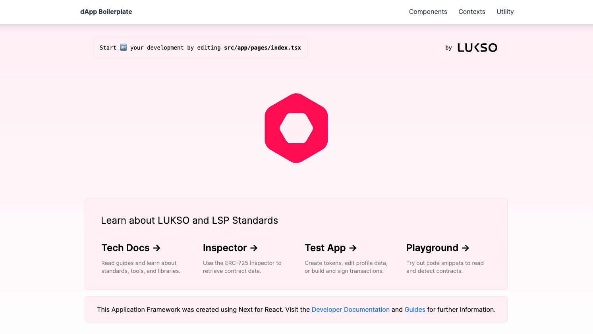

# 🏗️ Forever Memories (LUKSO dApp)

"Forever Memories" dApp focus on creating a dApp on the LUKSO blockchain that allows users to upload photos, encrypt them client-side, store them on IPFS, and manage them through categorised vaults (LSP-9). Each photo, along with its metadata, will be represented as an LSP-8 token, which will be stored in a relevant vault based on its category.

Demo URL: <https://forever.memories/>

More information is available on our 👉 [technical documentation](https://docs.lukso.tech/learn/introduction).



## Features

- User Photo Upload Interface
  ☛ A user-friendly interface that allows users to either take a photo using their device’s camera or upload a photo from their file system.
  ☛ This interface should be built using React for a seamless integration with the LUKSO blockchain and IPFS.
- Client-Side Encryption
  ☛ Implement encryption of the photo file directly on the user's device before it is uploaded to IPFS to ensure privacy and security.
  ☛ Use a strong encryption standard, ensuring that the encryption keys are managed securely and ideally are unique to the user or session.
- IPFS Integration for Storage
  ☛ After encryption, the photo will be uploaded to IPFS, and the IPFS hash of the encrypted file will be stored.
  ☛ The IPFS hash is critical as it will be used within the blockchain for referencing the photo in a decentralised manner.
- Vault Management (LSP-9)
  ☛ Develop smart contracts that allow users to create and manage different vaults for categorising their photos.
  ☛ Each vault can represent a different category (e.g., vacations, family, friends) and will contain multiple LSP-8 tokens, each corresponding to an individual photo or memory.
- Minting LSP-8 Tokens
  ☛ For each photo uploaded, an LSP-8 token will be minted. This token will represent the "memory," which includes the encrypted photo and metadata such as title, description, and the vault category it belongs to.
  ☛ The minting process will include assigning the photo's IPFS hash as part of the token's metadata to ensure that the photo can be identified and retrieved securely from IPFS.

## Development

- Built-in [`ethers.js`](https://docs.ethers.org/), [`erc725.js`](https://docs.lukso.tech/tools/erc725js/getting-started), [`lsp-smart-contracts`](https://docs.lukso.tech/tools/lsp-smart-contracts/getting-started)
- Uses `Tailwind`, `Prettier`, `TypeScript`


Clone the repository:

```bash
git clone git@github.com:lukso-network/tools-dapp-boilerplate.git
```

Install all packages and libraries:

```bash
npm install
```

Setup local environment variables:

> If you use Wallet Connect, you will have to import a Project ID. You can simply copy the example environment file and input the parameter.

```bash
cp .env.local.example .env.local
```

Run the development server:

```bash
npm run dev
```
### Modified

- 2024. 4. 30
